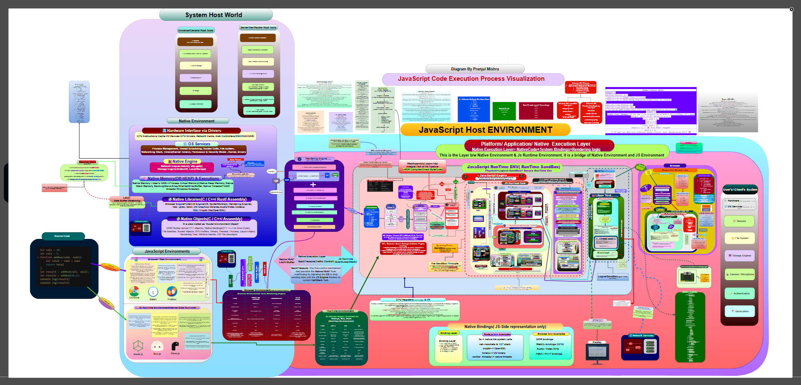

# JSCEP — JavaScript Code Execution Process


**A comprehensive visual architecture map of JavaScript internals** — covering the V8 engine pipeline, Browser Runtime, Node.js Runtime, Execution Context System, Memory Management, Event Loop, WebAssembly, and the full optimization lifecycle.

📄 **[View the full diagram (SVG)](./JSCEP-Ultimate.svg)**

****

---

## Why JSCEP?

Most JavaScript diagrams explain one thing in isolation — the Event Loop, or the Call Stack, or the V8 pipeline. JSCEP is different: it's **one visual map of the complete JavaScript ecosystem**, showing how all the pieces connect —

- Browser **and** Node.js runtimes, side by side
- V8 internals — parser, bytecode, JIT tiers, deoptimization
- Execution Contexts, Environment Records, Scope Chains
- Memory Management & Garbage Collection (Orinoco)
- Event Loop, Microtasks, Macrotasks
- Rendering Pipeline
- WebAssembly

JSCEP is an educational and architectural visualization project that explains how JavaScript works — from source code to machine code execution. The goal is to help learners understand JavaScript as a **complete execution platform**, not a collection of isolated concepts.

---

## Who Is This For?

- **Beginners** — get the big-picture overview of how JS actually runs
- **Intermediate developers** — understand runtime behavior, async execution, memory
- **Advanced developers** — dig into V8 internals, GC phases, rendering, execution context internals

**What this project is *not*:**
- Not a replacement for the ECMAScript specification
- Not a browser engine implementation document
- An educational architecture map with deliberate simplifications for learning clarity (see [Important Notes](#important-notes))

---

## How to View

The diagram is provided as a single self-contained SVG file — [`JSCEP-Ultimate.svg`](./JSCEP-Ultimate.svg).

For the best experience, download it and open it in your browser (works fully offline), or use GitHub's built-in file preview and zoom in directly.

---

## Project Goal

**How does JavaScript really work?**

```
Source Code
      ↓
V8 Engine
      ↓
Execution Contexts
      ↓
Memory Management
      ↓
Browser / Node Runtime
      ↓
Machine Code
      ↓
CPU Instruction Execution
```

---

## Architecture Coverage

### 1. JavaScript Source Processing Pipeline

```
JavaScript Source Code
        ↓
Lexer / Scanner
        ↓
Parser
        ↓
AST
        ↓
Scope & Binding Analysis
        ↓
Ignition Interpreter
```

Covered: UTF-16 source reading, tokenization, syntax parsing, AST construction, scope analysis, binding resolution.

---

### 2. V8 Engine Pipeline

```
Lexer → Parser → AST → Scope & Binding Analysis → Ignition
                                                       ↓
                                          Sparkplug → Maglev → TurboFan
```

**Ignition** (Interpreter) — Bytecode generation, bytecode execution, feedback collection, runtime profiling.

**JIT Optimization Tiers** — Sparkplug (fast baseline compiler) → Maglev (mid-tier optimizer) → TurboFan (advanced optimizer, internally redesigned around the Turboshaft architecture) — used for hot functions, runtime optimization, and machine code generation.

---

### 3. DeOptimization & ReOptimization

**DeOptimization**
```
Optimized Machine Code → Guard Check Failure → Discard Optimized Code → Fallback to Ignition Bytecode
```

**ReOptimization**
```
Ignition Bytecode → Feedback Vector Updates → JIT Compilation → New Optimized Machine Code
```

Covered: BailOut, guard checks, type changes, feedback vectors, the reoptimization cycle.

---

### 4. Execution Context System

**Global Execution Context (GEC)**
```
GEC
├── Global Lexical Environment
├── Global Environment Record
├── Global 'this' Binding
└── Runtime Metadata
```

**Function Execution Context (FEC)**
```
FEC
├── Runtime State
├── Lexical Environment
├── Variable Environment
├── Private Environment
└── Metadata Links
```

Also covered: Eval Execution Context, Module Execution Context, Generator state linkage (`suspendedStart` → `suspendedYield` → `executing` → `completed`).

---

### 5. Environment Records

| Record | Stores | Used By |
|---|---|---|
| Declarative (DER) | `let`, `const`, `class`, parameters | Block/function scopes |
| Object (OER) | Global object bindings | Global scope, `with()` |
| Function (FER) | `this`, `arguments`, `super`, `new.target` | Function invocation |
| Global (GER) | Composite of DER + OER | Top-level program |
| Module (MER) | Import/export bindings | ES Modules |

Covered: scope chains, identifier resolution, outer environment references.

---

### 6. Scope Chain Architecture

```
Global Scope
      ↑
Function Scope
      ↑
Nested Function Scope
```

Explains lexical scoping, closure resolution, and variable lookup.

---

### 7. Memory Management

**Heap** — stores Objects, Arrays, Functions, Closures, Promises, Prototypes, Error Objects, Hidden Classes, Arguments Objects.

**Call Stack** — LIFO structure holding GEC and nested FECs; explains execution context stack behavior and function invocation flow.

---

### 8. Garbage Collection — V8's Orinoco

- Tri-Color Marking (White / Grey / Black markers)
- Minor GC (Scavenger) for Young Generation
- Major GC (Mark-Compact) for Old Generation
- Incremental, Concurrent, and Parallel collection phases
- `WeakRef` and `FinalizationRegistry`

Covered: reachability, memory cleanup, background GC threads.

---

### 9. Browser Architecture

```
Browser
│
├── Browser Host Services Layer
│     ├── Rendering Engine
│     ├── Networking Stack
│     ├── Resource Fetching System
│     ├── Storage System
│     ├── Security Sandbox Layer
│     └── Module Loader System
│
└── JavaScript Runtime Container
```

**Rendering Pipeline**
```
HTML Parser → DOM   ┐
                     ├→ Render Tree → Layout → Paint → Compositor → Frames
CSS Parser → CSSOM   ┘
```

---

### 10. Node.js Runtime Architecture

```
Node.js Runtime
│
├── Node Host Services Layer
│     ├── File System
│     ├── Network Stack
│     ├── OS Interface
│     ├── Process Manager
│     ├── Native Addons
│     └── Module Loader
│
├── libuv Core
│     ├── Event Loop
│     ├── Thread Pool
│     ├── Timers
│     ├── I/O Polling
│     ├── Async Scheduling
│     └── OS Abstraction Layer
│
└── V8 Engine
      ├── Execution Context System
      ├── Call Stack
      ├── Heap
      ├── GC
      └── Compiler Pipeline
```

---

### 11. Event Loop System

Covered: Call Stack, Microtask Queue, Macrotask Queue, the Event Loop itself, and callback scheduling — including Promise jobs, timers, async operations, and queue prioritization.

---

### 12. WebAssembly (WASM)

```
Source Language (C/C++/Rust/Go/Zig)
        ↓
Compiler / Toolchain
        ↓
.wasm
        ↓
Host Runtime Loader
        ↓
WASM Runtime (Module Loader → Validator → Compiler/JIT → Execution Engine → Linear Memory)
        ↓
Machine Code → CPU
```

Supported runtime models: Browser, Node.js, Bun, Deno.

---

## Important Notes

JSCEP is an educational architecture model. Some sections intentionally simplify engine implementation details for learning clarity — for example, execution context visualization, environment record representation, memory layout models, and heap simplification.

Actual implementations vary across engines (V8, SpiderMonkey, JavaScriptCore, and legacy Chakra), and evolve over time as engines are updated.

---

## References

- [ECMAScript Specification](https://tc39.es/ecma262/)
- [V8 Documentation](https://v8.dev/docs)
- [Node.js Documentation](https://nodejs.org/en/docs)
- [MDN Web Docs](https://developer.mozilla.org/en-US/docs/Web/JavaScript)
- [WebAssembly Documentation](https://webassembly.org/)

---

## License

Educational and Research Use.

---

## Author

**Pranjul Mishra**
*JSCEP — JavaScript Code Execution Process*
Understanding JavaScript from Source Code to Machine Code Execution.
